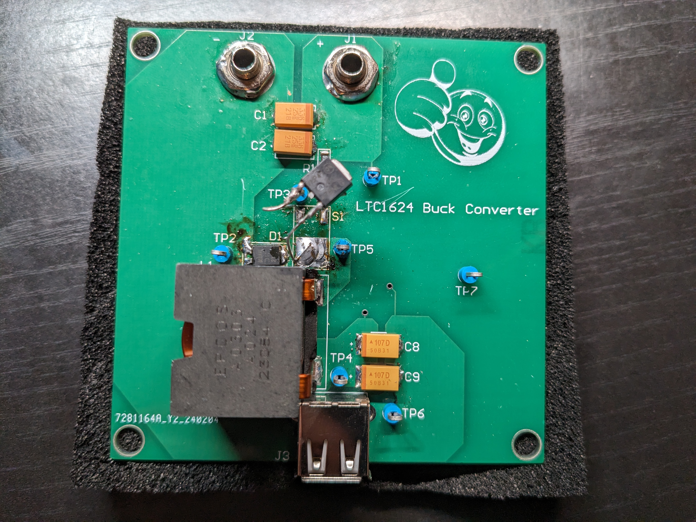
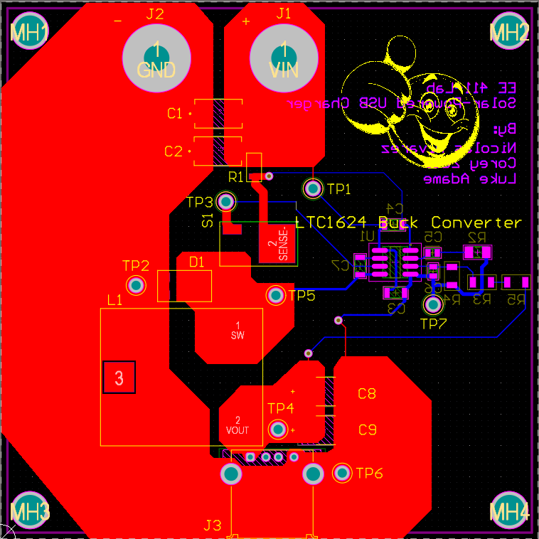
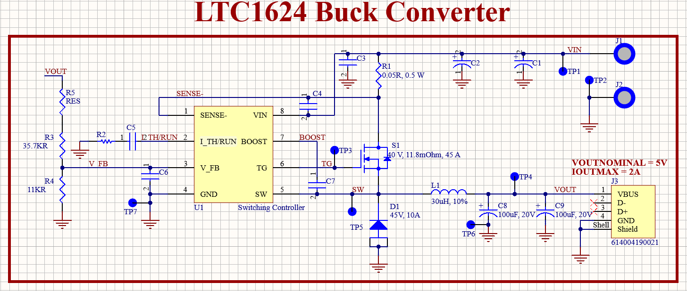

# Solar_Phone_Charger

<!-- PROJECT LOGO -->
 

  

  

    DC-DC Buck Converter with input from solar panel to a USB-A output
     
  

<!-- USAGE EXAMPLES -->
## How it Works
1. The DC-DC Buck Converter uses an LTC1624 200kHz fixed-frequency switching controller. 
2. Input is taken from a provided small solar panel and connected via banana plugs. 
3. Filtered with input capacitors, power flows through an RSENSE resistor that sets the max output current and then to the Drain of a MOSFET. 
4. Power flows through the switch and Schottky Diode through the inductor and output to a USB-A connection after some filtering capacitors.

<!-- ABOUT THE PROJECT -->
## Project Pictures!

  

  

### Software Used

* Altium (Free for students!)
* Gerber Viewer 7.0 (Free!)
* LTspice for simulation (Also free!)

## Notes to Self and Helpful for Others

When you've got the board assembled and there's something wrong, it's important to follow the following steps in order. 
I have found this to be the most effective use of time to determine what is wrong with a PCB board. 

These steps have been made after solving issues with this board. The below list is a way for me to learn and reflect past
strategies prevent future similar mistakes (hopefully!) and save time.

### Circuit debugging Steps
1. Observe any damages to components or extreme heat emanating from the board
2. Check that your input supply is turned ON. Start with NO-LOAD at the output.
3. Check Input and Output connections. Make sure they are electrically sound
4. Perform point-point continuity testing with a multimeter using probes
5. Probe GND and move through every connection making sure there are no unwanted shorts to GND
6. Check the footprints. It's possible the pins assigned to the footprints do not correctly reflect the pins of the device (In our case the MOSFET's pin connections were mismatched on the footprint
7. Verify that the simulation where you derived the component values from is reflected in your design
8. Verify any significant nodes (Such as the switching node) look as expected

<!-- ROADMAP -->
## Roadmap

- [X] Choose a switching controller
- [x] Follow a LTC1624 Design guide to bias for 5V output and 2A max current
- [X] Simulate controller in LTspice to find minimum component values for desired Line and Load Regulation specs
- [X] Design review with professor -> Make necessary/suggested changes to design
- [X] Order board (Used JLC PCB)
- [X] Assemble and test board
- [X] Make changes to ECAD files after any errors are found
- [X] Get oscilloscope captures
- [X] Add documentation of equations used
- [X] Add BOM

<!-- CONTACT -->
## Contributors

* Nicolas Alvarez (README.md Author) - nalvar95@outlook.com - www.linkedin.com/in/nicolas-alvarez-69061b1b6
* Luke Adame - lukeadame@yahoo.com
* Corey Zaas - coreyzaas@gmail.com

<!-- ACKNOWLEDGMENTS -->
## Acknowledgments

* [Footprint Reference Guide](https://www.slideshare.net/abishus/smt-notes)
* Professor Taufik - Cal Poly

:smile:

(<a href="#readme-top">back to top</a>)

